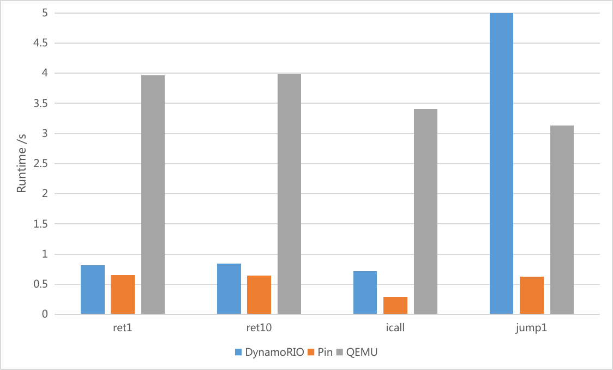
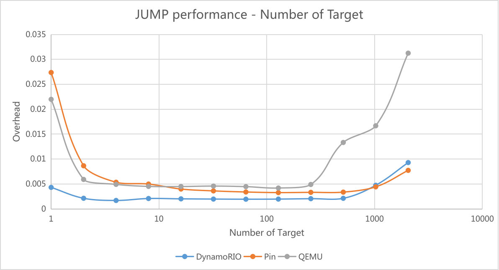

## Microbenchmark of Indirect Branches on Binary Translator
    Evaluating the performance characteristics of binary translators across indirect jumps with varying characteristics.

### TODO
- Ddd more benchmarks

### Different types of indirect jump

### jump with different target

